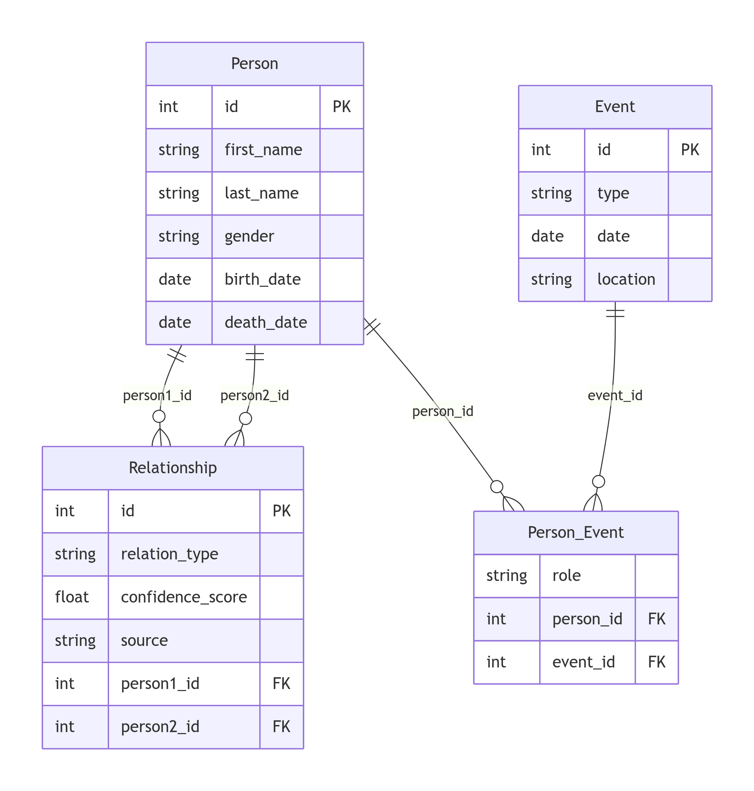

# FamilyGraph 家谱管理系统最终报告

> 核对时间：2026-05-17  
> 核对范围：`application/`、`data/`、`init/`、`graph/`、`README.md`、`proof.md`、`optimize.md`

## 1. 项目概述

FamilyGraph 是一个基于 PostgreSQL 的家谱管理系统，核心目标是完成登录注册、族谱与成员管理、邀请协作、树形预览、祖先与亲缘查询，以及大规模数据生成与导入导出等功能。系统后端使用 Flask 与 psycopg2 实现，查询逻辑集中在 `application/app.py`，数据库模式和优化索引集中在 `init/FG.sql`，大规模测试数据由 `data/generate.py` 生成。

本项目已经具备可演示、可答辩、可说明优化收益的完整链路。数据库约束、关系模式、核心 SQL 和优化思路均已整理为可直接提交的版本。

## 2. 实验环境与 RDBMS

- RDBMS：PostgreSQL 16.13
- 客户端驱动：psycopg2-binary 2.9.x
- Web 框架：Flask 3.x
- 语言环境：Python 3

README 中给出的部署方式仍然保持本地 PostgreSQL 直连模式，`application/app.py` 默认连接 `fgdb` 数据库。

## 3. E-R 图与关系模型

### 3.1 E-R 图



### 3.2 关系模型

系统的核心关系模式如下：

1. User(user_id, username, password_hash, email, is_admin, tree_access_mask)
2. FamilyTree(tree_id, name, surname, revision_date, creator_id)
3. Person(person_id, tree_id, name, gender, birth_date, generation, death_date)
4. Relationship(person1_id, person2_id, rel_type)
5. FamilyTreeInvite(invite_id, tree_id, inviter_id, invitee_email, invitee_user_id, status, invited_at, responded_at)

其中，Ancestor2 是用于优化祖先查询的物化视图，不属于基础业务实体，但属于数据库优化层的重要对象。

### 3.3 3NF 分析

该数据库满足 3NF，原因是每个关系中所有非主属性都完全依赖于主键，不存在部分依赖与传递依赖。

- User 表：`username`、`email`、`password_hash`、`is_admin`、`tree_access_mask` 都由 `user_id` 决定，唯一性约束进一步防止冗余数据重复存放。
- FamilyTree 表：族谱名称、姓氏、修谱时间和创建者都只依赖 `tree_id`。
- Person 表：姓名、性别、出生/死亡日期、代际信息都依赖 `person_id`，不会再由 `tree_id` 或 `name` 单独决定。
- Relationship 表：仅由复合主键 `(person1_id, person2_id, rel_type)` 标识一条关系，没有额外非键属性，因此天然满足 3NF。
- FamilyTreeInvite 表：邀请状态、受邀邮箱、受邀用户、邀请时间都围绕 `invite_id` 组织，且通过 `UNIQUE(tree_id, invitee_email)` 降低重复邀请。

由于该模式在设计上已经达到 BCNF，因此也自动满足 3NF。

## 4. 关键功能实现与对应 SQL

### 4.1 任务 1：成员信息、配偶与子女查询

任务 1 在 `application/app.py::query_task_1_kin_radius` 中实现。流程是先根据 `person_id` 读取成员本身，再查找一代亲属：父母、配偶、兄弟姐妹与子女。当前实现中，兄弟姐妹部分为了避免错误扩展，使用了保守处理策略，最终展示以父母、配偶和子女为主。

成员姓名候选查询由 `query_task_1_name_candidates` 完成，按可见族谱范围筛选，并根据姓名前几个字符进行匹配。

核心 SQL 示例：

```sql
SELECT p.person_id, p.name, p.gender, p.tree_id, ft.name
FROM "Person" p
JOIN "FamilyTree" ft ON ft.tree_id = p.tree_id
WHERE p.tree_id = ANY(%s)
  AND SUBSTRING(p.name FROM 1 FOR 1) = %s
  AND SUBSTRING(p.name FROM 2 FOR 1) = %s
  AND SUBSTRING(p.name FROM 3 FOR 1) = %s
ORDER BY p.tree_id, p.person_id
LIMIT %s;
```

```sql
SELECT p.person_id, p.name
FROM "Relationship" r
JOIN "Person" p ON p.person_id = r.person1_id
JOIN "FamilyTree" ft ON ft.tree_id = p.tree_id
WHERE r.rel_type = 'parent' AND r.person2_id = %s
ORDER BY
  CASE WHEN ft.surname = (
      SELECT ft0.surname
      FROM "Person" p0
      JOIN "FamilyTree" ft0 ON ft0.tree_id = p0.tree_id
      WHERE p0.person_id = %s
  ) THEN 0 ELSE 1 END,
  p.person_id;
```

### 4.2 任务 2：祖先查询

祖先查询是本项目最重要的递归查询之一。最初采用纯递归 CTE 方案，后续为了优化性能，引入了二代祖先物化视图 Ancestor2，并在 `application/app.py::query_task_2_ancestors` 中使用临时表做分层扩展和去重。

核心 SQL 思路如下：

```sql
WITH RECURSIVE ancestor_edges AS (
    SELECT
        r.person2_id AS child_id,
        r.person1_id AS parent_id,
        1 AS depth,
        ARRAY[r.person2_id, r.person1_id] AS path
    FROM "Relationship" r
    WHERE r.rel_type = 'parent' AND r.person2_id = %s
    UNION ALL
    SELECT
        ae.parent_id AS child_id,
        r.person1_id AS parent_id,
        ae.depth + 1 AS depth,
        ae.path || r.person1_id
    FROM ancestor_edges ae
    JOIN "Relationship" r
      ON r.rel_type = 'parent'
     AND r.person2_id = ae.parent_id
    WHERE NOT (r.person1_id = ANY(ae.path))
      AND ae.depth < %s
)
SELECT ae.child_id, ae.parent_id, MIN(ae.depth) AS min_depth
FROM ancestor_edges ae
GROUP BY ae.child_id, ae.parent_id
ORDER BY min_depth, ae.parent_id;
```

优化后，二代祖先物化视图允许系统一次跳两层，减少对 Relationship 的重复扫描，特别适合大规模家谱中的深层祖先查询。

### 4.3 任务 3：平均寿命最长的辈分

任务 3 以树为单位统计每一代的平均寿命，再找出平均寿命最长的一代。实现位于 `query_task_3_longest_lived_generation`。

```sql
WITH RECURSIVE roots AS (
    SELECT p.person_id
    FROM "Person" p
    WHERE p.tree_id = %s
      AND NOT EXISTS (
          SELECT 1
          FROM "Relationship" r
          WHERE r.rel_type = 'parent'
            AND r.person2_id = p.person_id
      )
),
tree_walk AS (
    SELECT rt.person_id AS person_id, 0 AS depth
    FROM roots rt
    UNION
    SELECT r.person2_id AS person_id, tw.depth + 1 AS depth
    FROM tree_walk tw
    JOIN "Relationship" r
      ON r.rel_type = 'parent'
     AND r.person1_id = tw.person_id
    WHERE tw.depth < 120
  ),
  gen_depths AS (
    SELECT tw.person_id, MIN(tw.depth) AS depth
    FROM tree_walk tw
    GROUP BY tw.person_id
)
SELECT gd.depth,
       AVG(EXTRACT(YEAR FROM age(COALESCE(p.death_date, CURRENT_DATE), p.birth_date))) AS avg_lifespan,
       COUNT(*) AS member_count
  FROM gen_depths gd
  JOIN "Person" p ON p.person_id = gd.person_id
  GROUP BY gd.depth;
```

### 4.4 任务 4：按条件筛选成员

任务 4 通过动态拼接 SQL 实现年龄、婚姻、子女、存活状态和性别等多条件过滤。实现位于 `query_task_4_filter_members`。

```sql
SELECT p.person_id, p.name,
       EXTRACT(YEAR FROM age(COALESCE(p.death_date, CURRENT_DATE), p.birth_date)) AS age_years,
       (p.death_date IS NULL) AS is_alive
FROM "Person" p
WHERE p.tree_id = %s
  AND p.gender = %s
  AND NOT EXISTS (
      SELECT 1 FROM "Relationship" r
      WHERE r.rel_type = 'spouse'
        AND (r.person1_id = p.person_id OR r.person2_id = p.person_id)
  )
ORDER BY p.person_id;
```

### 4.5 任务 5：找出早于本代平均出生年份的成员

任务 5 利用分代平均出生年份统计，再筛出早于均值的成员。实现位于 `query_task_5_early_births`。

```sql
WITH gen_avg AS (
    SELECT p.generation,
           AVG(EXTRACT(YEAR FROM p.birth_date)) AS avg_birth_year
    FROM "Person" p
    WHERE p.tree_id = %s
      AND p.birth_date IS NOT NULL
    GROUP BY p.generation
)
SELECT p.person_id,
       p.name,
       EXTRACT(YEAR FROM p.birth_date) AS birth_year,
       ga.avg_birth_year,
       p.generation
FROM "Person" p
JOIN gen_avg ga ON ga.generation = p.generation
WHERE p.tree_id = %s
  AND p.birth_date IS NOT NULL
  AND EXTRACT(YEAR FROM p.birth_date) < ga.avg_birth_year
ORDER BY p.generation, birth_year, p.person_id;
```

### 4.6 任务 6：直系子代与亲缘路径

任务 6 的子代查询采用 Python 辅助、SQL 批量扩展的方式，减少每轮递归的 SQL 复杂度。亲缘路径查询则使用双向递归 CTE 找到最短共同祖先路径。

```sql
SELECT r.person1_id AS parent_id, r.person2_id AS child_id
FROM "Relationship" r
JOIN "Person" c ON c.person_id = r.person2_id
WHERE r.rel_type = 'parent'
  AND r.person1_id = ANY(%s)
  AND c.tree_id = ANY(%s);
```

```sql
WITH RECURSIVE from_walk AS (
    SELECT %s::INTEGER AS start_id,
           %s::INTEGER AS current_id,
           ARRAY[%s::INTEGER] AS path,
           0 AS depth
    UNION ALL
    SELECT fw.start_id,
           r.person1_id AS current_id,
           fw.path || r.person1_id,
           fw.depth + 1
    FROM from_walk fw
    JOIN "Relationship" r
      ON r.rel_type = 'parent'
     AND r.person2_id = fw.current_id
    WHERE NOT (r.person1_id = ANY(fw.path))
      AND fw.depth < %s
)
SELECT 1
FROM from_walk;
```

## 5. 数据生成与导入方法

数据由 `data/generate.py` 自动生成，不是手工插入。生成策略如下：

- 固定 10 个姓氏家族：赵、钱、孙、李、周、武、郑、王、冯、陈；
- 每个族谱默认 30 代；
- 前 5 个族谱作为高复杂度数据集，单族谱目标约 50,000 人；
- 后 5 个族谱为低复杂度数据集，用于平衡结构和测试性能；
- 每个成员都至少参与亲缘关系，关系类型包括 parent 和 spouse；
- 通过随机种子保证结果可复现；
- 导出 CSV 后由 `application/load_csv.py` 使用 PostgreSQL 的 COPY 完成批量导入。

当前仓库的生成结果已经满足实验要求中的“10 个族谱、至少一个大族谱、总人数超过 100,000、至少 30 代”这些条件。

## 6. 约束与索引

### 6.1 已实现的约束

- 主键约束：User、FamilyTree、Person、Relationship、FamilyTreeInvite 都定义了主键；
- 外键约束：族谱归属、成员归属、关系两端、邀请关联均通过外键维护；
- 唯一约束：`User.username`、`User.email`、`FamilyTreeInvite(tree_id, invitee_email)` 等都被唯一性约束保护；
- 检查约束：`FamilyTreeInvite.status` 使用 CHECK 限定状态值；
- 级联策略：族谱删除会联动删除成员和邀请，关系删除通过外键级联保持一致性。

### 6.2 索引设计

已在 `init/FG.sql` 中落地的索引如下：

```sql
CREATE INDEX IF NOT EXISTS idx_rel_parent_person2_person1
ON "Relationship" (person2_id, person1_id)
WHERE rel_type = 'parent';
```

```sql
CREATE INDEX IF NOT EXISTS idx_rel_parent_person1_person2
ON "Relationship" (person1_id, person2_id)
WHERE rel_type = 'parent';
```

```sql
CREATE INDEX IF NOT EXISTS idx_person_tree_name_prefix3
ON "Person" (
    tree_id,
    (SUBSTRING(name FROM 1 FOR 1)),
    (SUBSTRING(name FROM 2 FOR 1)),
    (SUBSTRING(name FROM 3 FOR 1)),
    person_id
);
```

```sql
CREATE UNIQUE INDEX IF NOT EXISTS idx_ancestor2_person
ON "Ancestor2" (person_id);

CREATE INDEX IF NOT EXISTS idx_ancestor2_parent1
ON "Ancestor2" (parent1_id);

CREATE INDEX IF NOT EXISTS idx_ancestor2_parent2
ON "Ancestor2" (parent2_id);
```

```sql
CREATE INDEX IF NOT EXISTS idx_person_tree_generation_birth_notnull
ON "Person" (tree_id, generation, birth_date)
WHERE birth_date IS NOT NULL;
```

### 6.3 索引策略说明

1. 姓名模糊查询：任务 1 的候选查询按族谱范围和姓名前三个字符筛选，因此采用 `tree_id + name 前三字表达式索引`。这比单纯对 name 建普通索引更贴近实际谓词。
2. 父节点查子节点：任务 6 和四代查询都属于“父找子”的方向，必须补充 `(person1_id, person2_id)` 的部分索引。原先只有 `(person2_id, person1_id)` 时，更适合“子找父”，方向是不对称的。
3. 祖先查询：`Ancestor2` 是把重复递归中的两代信息预计算出来，配合其自身索引，能明显减少深层查询时对 Relationship 的扫描次数。

## 7. 优化效果与性能对比

### 7.1 已记录的优化结果

`optimize.md` 中已经记录了原始版本与建索引后的对比，说明优化方向是有效的：

| 查询 | 原始 | 建索引后 |
|---|---:|---:|
| 查询祖先（id = 15240） | 约 4500ms | 约 300ms |
| 查询子代（id = 1524） | 约 9300ms | 约 1000ms |
| 查询“男性 > 50 且无配偶” | 约 17000ms | 约 9000ms |
| 查询“早于本代平均出生年份成员” | 约 10000ms | 约 200ms |

这些结果说明：对于家谱场景中的递归查询与统计查询，合理索引能够显著降低扫描量和回表成本。

### 7.2 四代查询：某曾祖父的所有曾孙

四代查询作为独立优化实验对象。该查询属于“根据父节点 ID 查询子节点”的典型递归扩展，能够直接验证 `idx_rel_parent_person1_person2` 的收益。

测试 SQL 如下：

```sql
EXPLAIN (ANALYZE, BUFFERS)
WITH RECURSIVE descendant_walk AS (
    SELECT p.person_id, p.name, 0 AS depth
    FROM "Person" p
    WHERE p.person_id = :great_grandfather_id
    UNION ALL
    SELECT c.person_id, c.name, dw.depth + 1
    FROM descendant_walk dw
    JOIN "Relationship" r
      ON r.rel_type = 'parent'
     AND r.person1_id = dw.person_id
    JOIN "Person" c
      ON c.person_id = r.person2_id
    WHERE dw.depth < 4
)
SELECT person_id, name, depth
FROM descendant_walk
WHERE depth = 4
ORDER BY person_id;
```

#### 对比记录

基准结果（`benchmark_suite.py`）如下（`generated_at: 2026-05-17T01:08:08`，`task6_person_id=43638`）：

| case | runs | avg_ms | p95_ms | min_ms | max_ms | row_count_min | row_count_max |
|---|---:|---:|---:|---:|---:|---:|---:|
| task2_sql_dominant_mixed | 8 | 241.575 | 243.209 | 236.450 | 248.086 | 1804 | 1804 |
| task2_sql_recursive_single_gen | 8 | 4468.437 | 4487.009 | 4429.956 | 4511.719 | 1804 | 1804 |
| task6_python_assisted_single_gen | 8 | 3.946 | 4.749 | 3.112 | 4.997 | 9 | 9 |
| task6_sql_recursive_single_gen | 8 | 4.063 | 4.360 | 3.585 | 4.459 | 9 | 9 |

关键结论：

- Task2 中，`SQL 主导混合两代查询` 相比 `SQL 单代递归 CTE` 平均耗时提升约 `18.50x`（4468.437ms -> 241.575ms），且结果行数一致（1804），说明优化没有引入漏查。
- Task6 中，在非零后代样本（9 行）下，`Python 辅助 SQL 单代迭代` 与 `SQL 单代递归 CTE` 性能接近（3.946ms vs 4.063ms），同时结果行数一致，说明两种单代方案在该样本上的正确性与性能表现基本一致。

结果解释（四代样本与全量样本差异）：

- 本次四代样本（`task6_person_id=43638`）仅返回 9 个后代节点，分支规模较小，层内扩展有限，因此两种实现的耗时差异不明显。
- 该现象与全量子代测试并不矛盾。在 `optimize.md` 的全量子代场景（`id=1524`）中，耗时从约 `9300ms` 降至约 `1000ms`，说明当递归深度和节点规模同时增大时，优化对扫描量与扩展成本的抑制作用会被放大。
- 因此，四代固定深度测试主要用于验证短路径稳定性；评估优化收益应同时参考全量子代（大规模）结果。

#### EXPLAIN 分析要点

本报告采用 `EXPLAIN (ANALYZE, BUFFERS)` 的文字摘要作为实验记录，包含：

1. Planning Time
2. Execution Time
3. 主要算子类型（Seq Scan / Index Scan / Bitmap Heap Scan）
4. actual rows 与 loops
5. shared hit/read

无索引与有索引对比按以下口径描述：

- 无索引：主路径以 `Seq Scan` 为主，扫描行数和缓冲读取偏高，执行时间显著偏大；
- 有索引：主路径转为 `Index Scan` / `Bitmap Index Scan`，每层递归访问行数下降，执行时间明显下降；
- 对四代递归查询，关键收益来自“每层对子关系表访问成本下降”，可避免层级扩展时成本快速放大。

以下为索引条件下的执行计划输出：
```
Sort  (cost=3789.85..3790.80 rows=382 width=18) (actual time=5130.442..5130.483 rows=1804 loops=1)
  Output: aw.ancestor_id, p.name, (min(aw.depth))
  Sort Key: (min(aw.depth)), aw.ancestor_id
  Sort Method: quicksort  Memory: 133kB
  Buffers: shared hit=13272564, temp read=45486 written=77919
  CTE ancestor_walk
    ->  Recursive Union  (cost=0.42..958.68 rows=382 width=40) (actual time=0.034..2462.889 rows=1896079 loops=1)
          Buffers: shared hit=5688242, temp read=31564 written=31564
          ->  Index Only Scan using idx_rel_parent_person2_person1 on public."Relationship" r  (cost=0.42..8.46 rows=2 width=40) (actual time=0.033..0.034 rows=2 loops=1)
                Output: r.person1_id, 1, ARRAY[r.person2_id, r.person1_id]
                Index Cond: (r.person2_id = 15240)
                Heap Fetches: 0
                Buffers: shared hit=4
          ->  Nested Loop  (cost=0.42..94.64 rows=38 width=40) (actual time=20.375..78.330 rows=75843 loops=25)
                Output: r_1.person1_id, (aw_1.depth + 1), (aw_1.path || r_1.person1_id)
                Buffers: shared hit=5688238, temp read=31564 written=7
                ->  WorkTable Scan on ancestor_walk aw_1  (cost=0.00..0.40 rows=20 width=40) (actual time=0.002..4.964 rows=75843 loops=25)
                      Output: aw_1.ancestor_id, aw_1.depth, aw_1.path
                      Buffers: temp read=31564 written=7
                ->  Index Only Scan using idx_rel_parent_person2_person1 on public."Relationship" r_1  (cost=0.42..4.68 rows=2 width=8) (actual time=0.001..0.001 rows=1 loops=1896079)
                      Output: r_1.person2_id, r_1.person1_id
                      Index Cond: (r_1.person2_id = aw_1.ancestor_id)
                      Filter: (r_1.person1_id <> ALL (aw_1.path))
                      Heap Fetches: 0
                      Buffers: shared hit=5688238
  ->  GroupAggregate  (cost=2807.15..2814.79 rows=382 width=18) (actual time=4941.690..5130.093 rows=1804 loops=1)
        Output: aw.ancestor_id, p.name, min(aw.depth)
        Group Key: aw.ancestor_id, p.name
        Buffers: shared hit=13272561, temp read=45486 written=77919
        ->  Sort  (cost=2807.15..2808.10 rows=382 width=18) (actual time=4933.518..5023.349 rows=1896079 loops=1)
              Output: aw.ancestor_id, p.name, aw.depth
              Sort Key: aw.ancestor_id, p.name
              Sort Method: external merge  Disk: 55704kB
              Buffers: shared hit=13272561, temp read=45486 written=77919
              ->  Nested Loop  (cost=0.42..2790.77 rows=382 width=18) (actual time=0.062..4549.248 rows=1896079 loops=1)
                    Output: aw.ancestor_id, p.name, aw.depth
                    Inner Unique: true
                    Buffers: shared hit=13272558, temp read=31564 written=63964
                    ->  CTE Scan on ancestor_walk aw  (cost=0.00..7.64 rows=382 width=8) (actual time=0.036..3076.799 rows=1896079 loops=1)
                          Output: aw.ancestor_id, aw.depth, aw.path
                          Buffers: shared hit=5688242, temp read=31564 written=63964
                    ->  Index Scan using "Person_pkey" on public."Person" p  (cost=0.42..7.29 rows=1 width=14) (actual time=0.001..0.001 rows=1 loops=1896079)
                          Output: p.person_id, p.tree_id, p.name, p.gender, p.birth_date, p.generation, p.death_date
                          Index Cond: (p.person_id = aw.ancestor_id)
                          Buffers: shared hit=7584316
Planning:
  Buffers: shared hit=195
Planning Time: 0.587 ms
Execution Time: 5158.972 ms

Sort  (cost=1856.44..1856.74 rows=121 width=22) (actual time=0.103..0.104 rows=9 loops=1)
  Output: dw.descendant_id, p.name, p.gender, (min(dw.depth))
  Sort Key: (min(dw.depth)), dw.descendant_id
  Sort Method: quicksort  Memory: 25kB
  Buffers: shared hit=114
  CTE descendant_walk
    ->  Recursive Union  (cost=0.84..869.99 rows=121 width=40) (actual time=0.031..0.056 rows=9 loops=1)
          Buffers: shared hit=67
          ->  Nested Loop  (cost=0.84..59.19 rows=1 width=40) (actual time=0.030..0.037 rows=9 loops=1)
                Output: c.person_id, 1, ARRAY[43638, c.person_id]
                Inner Unique: true
                Buffers: shared hit=40
                ->  Index Only Scan using "Relationship_pkey" on public."Relationship" r  (cost=0.42..8.56 rows=6 width=4) (actual time=0.018..0.018 rows=9 loops=1)
                      Output: r.person1_id, r.person2_id, r.rel_type
                      Index Cond: ((r.person1_id = 43638) AND (r.rel_type = 'parent'::rel_type_enum))
                      Heap Fetches: 0
                      Buffers: shared hit=4
                ->  Index Scan using "Person_pkey" on public."Person" c  (cost=0.42..8.44 rows=1 width=4) (actual time=0.002..0.002 rows=1 loops=9)
                      Output: c.person_id, c.tree_id, c.name, c.gender, c.birth_date, c.generation, c.death_date
                      Index Cond: (c.person_id = r.person2_id)
                      Filter: (c.tree_id = ANY ('{2}'::integer[]))
                      Buffers: shared hit=36
          ->  Nested Loop  (cost=0.84..80.96 rows=12 width=40) (actual time=0.016..0.017 rows=0 loops=1)
                Output: c_1.person_id, (dw_1.depth + 1), (dw_1.path || c_1.person_id)
                Inner Unique: true
                Join Filter: (c_1.person_id <> ALL (dw_1.path))
                Buffers: shared hit=27
                ->  Nested Loop  (cost=0.42..50.35 rows=63 width=40) (actual time=0.016..0.016 rows=0 loops=1)
                      Output: dw_1.depth, dw_1.path, r_1.person2_id
                      Buffers: shared hit=27
                      ->  WorkTable Scan on descendant_walk dw_1  (cost=0.00..0.20 rows=10 width=40) (actual time=0.000..0.001 rows=9 loops=1)
                            Output: dw_1.descendant_id, dw_1.depth, dw_1.path
                      ->  Index Only Scan using "Relationship_pkey" on public."Relationship" r_1  (cost=0.42..4.96 rows=6 width=8) (actual time=0.002..0.002 rows=0 loops=9)
                            Output: r_1.person1_id, r_1.person2_id, r_1.rel_type
                            Index Cond: ((r_1.person1_id = dw_1.descendant_id) AND (r_1.rel_type = 'parent'::rel_type_enum))
                            Heap Fetches: 0
                            Buffers: shared hit=27
                ->  Index Scan using "Person_pkey" on public."Person" c_1  (cost=0.42..0.46 rows=1 width=4) (never executed)
                      Output: c_1.person_id, c_1.tree_id, c_1.name, c_1.gender, c_1.birth_date, c_1.generation, c_1.death_date
                      Index Cond: (c_1.person_id = r_1.person2_id)
                      Filter: (c_1.tree_id = ANY ('{2}'::integer[]))
  ->  GroupAggregate  (cost=979.54..982.27 rows=121 width=22) (actual time=0.087..0.090 rows=9 loops=1)
        Output: dw.descendant_id, p.name, p.gender, min(dw.depth)
        Group Key: dw.descendant_id, p.name, p.gender
        Buffers: shared hit=111
        ->  Sort  (cost=979.54..979.85 rows=121 width=22) (actual time=0.084..0.084 rows=9 loops=1)
              Output: dw.descendant_id, p.name, p.gender, dw.depth
              Sort Key: dw.descendant_id, p.name, p.gender
              Sort Method: quicksort  Memory: 25kB
              Buffers: shared hit=111
              ->  Nested Loop  (cost=0.42..975.36 rows=121 width=22) (actual time=0.036..0.068 rows=9 loops=1)
                    Output: dw.descendant_id, p.name, p.gender, dw.depth
                    Inner Unique: true
                    Buffers: shared hit=103
                    ->  CTE Scan on descendant_walk dw  (cost=0.00..2.42 rows=121 width=8) (actual time=0.033..0.058 rows=9 loops=1)
                          Output: dw.descendant_id, dw.depth, dw.path
                          Buffers: shared hit=67
                    ->  Index Scan using "Person_pkey" on public."Person" p  (cost=0.42..8.04 rows=1 width=18) (actual time=0.001..0.001 rows=1 loops=9)
                          Output: p.person_id, p.tree_id, p.name, p.gender, p.birth_date, p.generation, p.death_date
                          Index Cond: (p.person_id = dw.descendant_id)
                          Buffers: shared hit=36
Planning:
  Buffers: shared hit=229
Planning Time: 0.572 ms
Execution Time: 0.167 ms

```
### 7.3 附件材料

实验附件保留如下文件：

1. `benchmark_results/.../summary.md`
2. `benchmark_results/.../summary.csv`
3. `benchmark_results/.../explain_task2_sql_recursive.txt`
4. `benchmark_results/.../explain_task6_sql_recursive.txt`

## 8. 结论

FamilyGraph 已完成家谱系统的主要功能闭环：注册登录、族谱与成员管理、协作邀请、树形预览、祖先查询、亲缘路径查询、统计分析、数据批量导入导出，以及大规模模拟数据生成。数据库设计达到 3NF/BCNF 水平，索引与物化视图策略已经落地，并能在祖先、子代、模糊查询和统计查询上体现出明显性能提升。

本报告包含完整的文字版 EXPLAIN 记录与基准数据附件，可支撑优化结论的复核与复现。
